# Goose on Azure Container Apps

## Overview

This project provides a solution for deploying [Goose AI Agent](https://block.github.io/goose/) as an Azure Container App with GPU support (T4). It is intended to be ready to use with minimal user input and small service surface area. It leverages open source models and packages everything needed to have a functional agent deployed and ready-to-use once deployed. Starting the deployment should take no more than five minutes, the deployment itself should be complete and fully functional in 25 minutes.


## Installation & Setup

### Prerequisites

- [Azure CLI](https://docs.microsoft.com/en-us/cli/azure/install-azure-cli) installed and authenticated
- [Azure Developer CLI (azd)](https://learn.microsoft.com/en-us/azure/developer/azure-developer-cli/) installed and authenticated
- An Azure subscription with the following providers enabled:
  - `Microsoft.App` (Container Apps)
  - `Microsoft.ContainerRegistry`
  - `Microsoft.Storage`

### 1. Clone the repository

```bash
git clone https://github.com/simonjj/goose-on-aca.git
cd goose-on-aca
```

### 2. Deploy to Azure

Simply run the deployment command - all _required_ variables will be prompted during setup. 
```bash
azd up
```

> **Important Notes**
> * Proxy Auth Password will become your basic auth password
> * Please remember this template is currently intended to run model inference on Consumption > > GPU workload profiles which are only available in select regions:
>   - **West US 3**
>  - **Australia East**
>  - **Sweden Central**
>  - **[See here for the latest GPU region availability](https://learn.microsoft.com/en-us/azure/container-apps/workload-profiles-overview#gpu-workload-profiles)**
  

### 3. Access your deployment

After successful deployment, access URLs will be displayed:

```bash
# Get deployment status and URLs
azd env get-values
```

### 4. Enable MCP Servers (Optional)

To enable GitHub or Email MCP servers, update the environment variables in your deployed Container App:


> **Important Note**
> The current default model optimized to run on T4 (qwen3:14b) does not work with the Github MCP server (both stdio and streaming). It is hence suggested to upgrade both GPU profile and model if the user intends to use the Github MCP server.
>
> The default email provider is currently configured to be Gmail. The full configuration for the email servers (SMTP/IMAP), ports, SSL can be accessed via the default Goose configuration file located on the NFS file share (`/root/.config/goose/config.yaml`).


Running the commands below will set the environment variables and regenerate the configuration (upon restart of the app) to include the appropriate section needed for the respective MCP server to be added to the Goose configuration.

```bash
# Update GitHub MCP 
az containerapp update \
  --name <goose-app-name> \
  --resource-group <resource-group-name> \
  --set-env-vars GITHUB_PERSONAL_ACCESS_TOKEN="ghp_your_token_here"

# Update Email MCP 
az containerapp update \
  --name <goose-app-name> \
  --resource-group <resource-group-name> \
  --set-env-vars \
    MCP_EMAIL_SERVER_PASSWORD="your_app_password" \
    MCP_EMAIL_SERVER_EMAIL_ADDRESS="your-email@gmail.com" \
    MCP_EMAIL_SERVER_FULL_NAME="Your Name" \
    MCP_EMAIL_SERVER_USER_NAME="your-email@gmail.com"
```


## Overall Architecture

This application runs mostly on Azure Container Apps, persistence is provided via Azure Files (NFS) and containers are pushed and pulled from Azure Container Registry. The NFS file share is secured via a custom VNet and Private Endpoint. Managed Identity is used for container image access.

```mermaid
graph TB
    %% --- External Access ---
    subgraph "External Access"
        User[👤 User]
        Internet[🌐 Internet]
    end

    %% --- Azure Container Apps Environment ---
    subgraph "Azure Container Apps Environment"
        subgraph "Authentication Layer"
            Proxy[🔒 Nginx Auth Proxy<br/>Basic Auth]
        end
        
        subgraph "Application Layer"
            Goose[🤖 Goose Agent<br/>Web UI + CLI<br/>MCP Servers]
            Ollama[🧠 Ollama Model Server<br/>GPU: T4<br/>Model: qwen3:14b]
        end
        
        subgraph "MCP Extensions"
            EmailMCP[📧 Email MCP<br/>IMAP SMTP]
            GitHubMCP[🐙 GitHub MCP<br/>Repos Issues PRs]
            ComputerMCP[💻 Computer Controller<br/>System Automation]
            DeveloperMCP[👨‍💻 Developer MCP<br/>Shell Terminal Commands]
        end
    end

    %% --- Azure Infrastructure (Simplified) ---
    subgraph "Azure Infrastructure"
        Files[🗄️ Azure Files NFS<br/>Models Config Sessions]
    end

    %% --- GPU Profile ---
    subgraph "GPU Workload Profile"
        GPU[⚡ GPU T4<br/>Consumption Pay-per-use]
    end

    %% --- Connections ---
    User --> Internet --> Proxy --> Goose
    Goose --> Ollama
    Goose -.-> EmailMCP
    Goose -.-> GitHubMCP
    Goose -.-> ComputerMCP
    Goose -.-> DeveloperMCP
    Ollama --> GPU
    Goose --> Files
    Ollama --> Files

    %% --- Styling ---
    classDef service fill:#e1f5fe,stroke:#0277bd,stroke-width:2px
    classDef mcp fill:#e8f5e8,stroke:#2e7d32,stroke-width:2px,stroke-dasharray: 4 4
    classDef infra fill:#f3e5f5,stroke:#7b1fa2,stroke-width:2px
    classDef gpu fill:#fff3e0,stroke:#ef6c00,stroke-width:2px

    class Proxy,Goose,Ollama service
    class EmailMCP,GitHubMCP,ComputerMCP,DeveloperMCP mcp
    class Files infra
    class GPU gpu

```



### Core Services

1. **🤖 Goose Agent** (`app/goose/`)
   - AI agent service with web UI and CLI access
   - Supports multiple MCP (Model Context Protocol) servers
   - Persistent configuration and session storage
   - **[📖 Goose Component Documentation](app/goose/README.md)**

2. **🔒 Nginx Auth Proxy** (`app/nginx-auth-proxy/`)
   - Authentication gateway with basic auth
   - Request routing and timeout management
   - **[📖 Proxy Component Documentation](app/nginx-auth-proxy/README.md)**

3. **🧠 Ollama Model Puller and Server**
   - This pulls (via init container) and serves the model
   - Via Ollama this supports various [open-source models](https://ollama.com/library) (current default: qwen3:14b)
   - Runs on T4 Consumption GPU
   - Model Puller is included but not build as part of this project. [Please see README for more information.](app/ollama-image-pull/README.md)


## MCP Server Extensions

Goose has support for many MCP servers (also called Extensions). [To see a full list of extensions visit Goose's extension library](https://block.github.io/goose/docs/category/mcp-servers). For this instance of Goose agent we've included multiple MCP servers for enhanced capabilities:

- **📧 Email MCP** - Send and receive emails via IMAP/SMTP. [See here for full documentation.](https://github.com/ai-zerolab/mcp-email-server?tab=readme-ov-file)
- **🐙 GitHub MCP** - Repository management, issues, and pull requests. [See here for full documentation.](https://github.com/github/github-mcp-server)
- **💻 Computer Controller MCP** - System automation and file operations. [See here for full documenttion.](https://block.github.io/goose/docs/mcp/computer-controller-mcp)
- **👨‍💻 Developer Tools MCP** - Shell Terminal Commands. [See here for full documentation.](https://block.github.io/goose/docs/mcp/developer-mcp)

Simply calling `goose configure` via the Azure Container App's Portal Console option. Will provide a guided experience to enable more extensions.


## Project Structure

```
goose-on-aca/
├── 📋 azure.yaml              # Azure Developer CLI configuration
├── 📋 README.md               # This file
├── 🐳 app/                    # Application components
│   ├── 🤖 goose/             # Goose AI agent service
│   ├── 🔒 nginx-auth-proxy/   # Authentication proxy
│   └── 🧠 ollama-image-pull/  # Model puller and server
├── 🏗️ infra/                  # Infrastructure as Code (Bicep)
│   ├── main.bicep            # Main deployment template
│   ├── resources.bicep       # Core Azure resources
│   └── ollama.bicep          # GPU model server
└── 📚 docs/                   # Additional documentation
```


## Additional Notes & TODOs

### TODOs

- **Entra ID Authentication** - Replace basic auth with Azure AD integration
- **Consolidated Storage** - Optimize file storage architecture for better performance
- **Azure CLI MCP Server** - Direct Azure resource management from Goose
- **Enhanced GPU Support and model flexibility** - Support for A100 and alternate models such as GLM or Kimi
- **OpenAI API Integration** - Hybrid cloud/local model support


## Troubleshooting

### Common Issues

| Issue | Solution | 
|-------|----------|
| Deployment hangs | One of the most reliable ways to asses deployment state is the portal's Revisions and replicas view. For this application the deployment of the Ollama model puller and server take the longest. This is because the model for the server first gets pulled via a init container. Model download can take anywhere between 3 and 10 minutes. Thereafter the Ollama model server loads the model via the NFS file share which can take another 3 to 5 minutes. |
| Goose seems to be hanging / doesn't respond | Check to see if the model has been loaded on the Ollama app by running `ollama ps`. If the model has been loaded you can check for GPU activity by running `nvidia-smi`. | 
| The agent is confused, slow, doesn't do what I want it to | Goose's capabilities and effectiveness depends entirely on the chosen model. Using the default qwen3:14b model results in decent outcomes but can not compete with more capable models. Try configuring Goose via the `goose configure` command to use a different model |


## Contributing & Issues

Changes and improvements are welcome via pull requests. For an issues you find or quetions you may have please feel free to [raise an issue](https://github.com/simonjj/goose-on-aca/issues).


## License

This project is licensed under the Apache 2.0 License - see the [LICENSE](LICENSE) file for details.
