# Goose on Azure Container Apps

## Overview

This project provides a solution for deploying [Goose AI Agent](https://block.github.io/goose/) as an Azure Container App with GPU support (T4). It is intended to be ready to use with minimal user input and small service surface area. It leverages open source models and packages everything needed to have a functional agent deployed and ready-to-use once deployed. Starting the deployment should take no more than five minutes, the deployment itself should be complete and fully functional in 25 minutes.


## Installation & Setup

### Prerequisites

- [Azure CLI](https://docs.microsoft.com/en-us/cli/azure/install-azure-cli) installed and authenticated
- [Azure Developer CLI (azd)](https://learn.microsoft.com/en-us/azure/developer/azure-developer-cli/) installed and authenticated
- An Azure subscription with the following providers enabled:
  - `Microsoft.App` (Container Apps)
  - `Microsoft.ContainerRegistry`
  - `Microsoft.Storage`

### 1. Clone the repository

```bash
git clone https://github.com/simonjj/goose-on-aca.git
cd goose-on-aca
```

### 2. Deploy to Azure

Simply run the deployment command - all _required_ variables will be prompted during setup. 
```bash
azd up
```

> **Important Notes**
> * Proxy Auth Password will become your basic auth password
> * Please remember this template is currently intended to run model inference on Consumption > > GPU workload profiles which are only available in select regions:
>   - **West US 3**
>  - **Australia East**
>  - **Sweden Central**
>  - **[See here for the latest GPU region availability](https://learn.microsoft.com/en-us/azure/container-apps/workload-profiles-overview#gpu-workload-profiles)**
>  

### 3. Access your deployment

After successful deployment, access URLs will be displayed:

```bash
# Get deployment status and URLs
azd env get-values
```

### 4. Enable MCP Servers (Optional)

To enable GitHub or Email MCP servers, update the environment variables in your deployed Container App:


> **Important Note**
> The current default model optimized to run on T4 (qwen3:14b) does not work with the Github MCP server (both stdio and streaming). It is hence suggested to upgrade both GPU profile and model if the user intends to use the Github MCP server.
> 
> The default email provider is currently configured to be Gmail. The full configuration for the email servers (SMTP/IMAP), ports, SSL can be accessed via the default Goose configuration file located on the NFS file share (`/root/.config/goose/config.yaml`).


Running the commands below will set the environment variables and regenerate the configuration (upon restart of the app) to include the appropriate section needed for the respective MCP server to be added to the Goose configuration.

```bash
# Update GitHub MCP 
az containerapp update \
  --name <goose-app-name> \
  --resource-group <resource-group-name> \
  --set-env-vars GITHUB_PERSONAL_ACCESS_TOKEN="ghp_your_token_here"

# Update Email MCP 
az containerapp update \
  --name <goose-app-name> \
  --resource-group <resource-group-name> \
  --set-env-vars \
    MCP_EMAIL_SERVER_PASSWORD="your_app_password" \
    MCP_EMAIL_SERVER_EMAIL_ADDRESS="your-email@gmail.com" \
    MCP_EMAIL_SERVER_FULL_NAME="Your Name" \
    MCP_EMAIL_SERVER_USER_NAME="your-email@gmail.com"
```

### Delete Instructions

If you need to remove the deployment and clean up resources, follow these steps:

```bash
# Tear down the Azure deployment (prompts for confirmation)
azd down

# If you want to delete the entire resource group (replace <resource-group-name>)
az group delete --name <resource-group-name> --yes --no-wait
```

These commands will remove the Container App, associated Azure resources, and the NFS file share.

```

## Overall Architecture

This application runs mostly on Azure Container Apps, persistence is provided via Azure Files (NFS) and containers are pushed and pulled from Azure Container Registry. The NFS file share is secured via a custom VNet and Private Endpoint. Managed Identity is used for container image access.

```mermaid
graph TB
    %% --- External Access ---
    subgraph "External Access"
        User[👤 User]
        Internet[🌐 Internet]
    end

    %% --- Azure Container Apps Environment ---
    subgraph "Azure Container Apps Environment"
        subgraph "Authentication Layer"
            Proxy[🔒 Nginx Auth Proxy<br/>Basic Auth]
        end
        
        subgraph "Application Layer"
            Goose[🤖 Goose Agent<br/>Web UI + CLI<br/>MCP Servers]
            Ollama[🧠 Ollama Model Server<br/>GPU: T4<br/>Model: qwen3:14b]
        end
        
        subgraph "MCP Extensions"
            EmailMCP[📧 Email MCP<br/>IMAP SMTP]
            GitHubMCP[🐙 GitHub MCP<br/>Repos Issues PRs]
            ComputerMCP[💻 Computer Controller<br/>System Automation]
            DeveloperMCP[👨‍💻 Developer MCP<br/>Shell Terminal Commands]
        end
    end

    %% --- Azure Infrastructure (Simplified) ---
    subgraph "Azure Infrastructure"
        Files[🗄️ Azure Files NFS<br/>Models Config Sessions]
    end

    %% --- GPU Profile ---
    subgraph "GPU Workload Profile"
        GPU[⚡ GPU T4<br/>Consumption Pay-per-use]
    end

    %% --- Connections ---
    User --> Internet --> Proxy --> Goose
    Goose --> Ollama
    Goose -.-> EmailMCP
    Goose -.-> GitHubMCP
    Goose -.-> ComputerMCP
    Goose -.-> DeveloperMCP
    Ollama --> GPU
    Goose --> Files
    Ollama --> Files

    %% --- Styling ---
    classDef service fill:#e1f5fe,stroke:#0277bd,stroke-width:2px
    classDef mcp fill:#e8f5e8,stroke:#2e7d32,stroke-width:2px,stroke-dasharray: 4 4
    classDef infra fill:#f3e5f5,stroke:#7b1fa2,stroke-width:2px
    classDef gpu fill:#fff3e0,stroke:#ef6c00,stroke-width:2px

    class Proxy,Goose,Ollama service
    class EmailMCP,GitHubMCP,ComputerMCP,DeveloperMCP mcp
    class Files infra
    class GPU gpu
```

